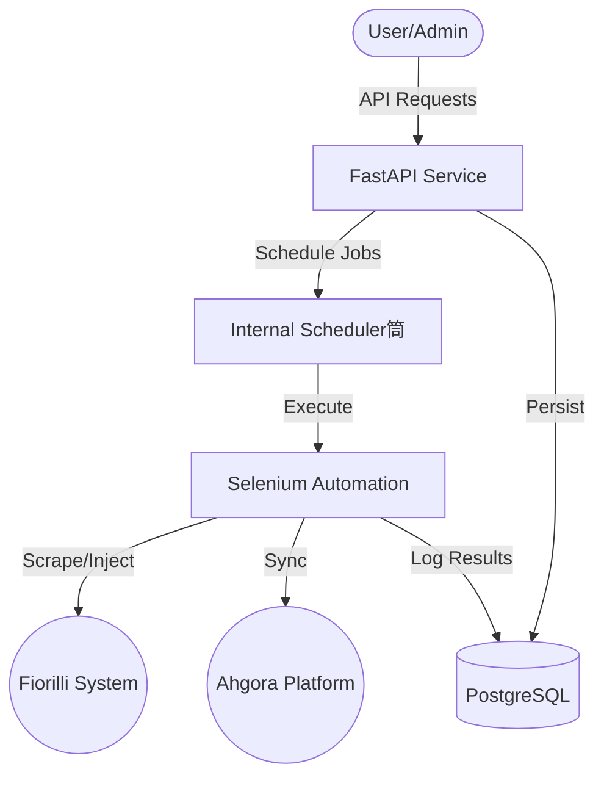

# 🚀 FioGora (Fiorilli-Ahgora Integration)

[](https://www.python.org/downloads/)
[](https://fastapi.tiangolo.com/)
[](https://www.docker.com/)
[](https://opensource.org/licenses/MIT)

**FioGora** is a high-performance RPA integration service that automates the synchronization of employee data between the **Fiorilli** management system and the **Ahgora** time-tracking platform. It leverages **FastAPI** for management, **PostgreSQL** for persistence, and **Selenium** for robust automation.

---

## ✨ Key Features

- 🔄 **Automated Synchronization**: Seamlessly bridge Fiorilli and Ahgora.
- ⚡ **Asynchronous Architecture**: Background task management using FastAPI Lifespan and dedicated schedulers.
- 🐳 **Docker-First**: Fully containerized environment for consistent deployment.
- 📊 **Job Management**: REST API to monitor, list, and review detailed logs of every sync task.
- 🛠️ **Task Retry System**: Built-in scheduler to handle transient automation failures.
- 📝 **Detailed Logging**: Granular execution logs available via API.

---

## 📐 System Architecture



---

## 🚀 Quick Start

### 1. Requirements

- **Docker & Docker Compose** (Recommended)
- **OR** Python 3.13 (`uv`), PostgreSQL, and Firefox (for local dev).

### 2. Configuration

Create a `.env` file from the example:
```bash
cp .env.example .env
```
Fill in your `FIORILLI_*` and `AHGORA_*` credentials.

### 3. Running with Docker (Recommended)

```bash
docker-compose up --build
```
- **API**: `http://localhost:8000`
- **Docs (Swagger)**: `http://localhost:8000/docs`

---

## 🛠️ Development & Automation

This project uses `just` for command automation.

| Command | Description |
| :--- | :--- |
| `just all` | Clean and build the executable |
| `just build` | Create a standalone executable using PyInstaller |
| `just update` | Rebuild with data backup/restore |
| `just clean` | Remove build artifacts |

---

## 🛣️ API Overview

| Method | Endpoint | Description |
| :--- | :--- | :--- |
| `POST` | `/api/sync/run` | Trigger a new sync job |
| `GET` | `/api/sync/jobs` | List all synchronization jobs |
| `GET` | `/api/sync/jobs/{id}` | Get specific job details |
| `GET` | `/api/sync/jobs/{id}/logs` | Fetch detailed logs for a job |
| `GET` | `/health` | Service health status |

---

## 📂 Project Structure

```text
fiogora/
├── app/
│   ├── api/            # REST API Layer
│   ├── core/           # Config, DB, and Scheduler logic
│   ├── domain/         # Business entities and schemas
│   ├── infrastructure/ # RPA (Selenium) and Repositories
│   ├── services/       # Core business logic
│   └── main.py         # Application Entrypoint
├── tests/              # Test suite
├── Dockerfile          # Container definition
└── docker-compose.yml  # Service orchestration
```

---

## 📜 License

Distributed under the **MIT License**. See `LICENSE` for more information.

---
> Developed with ❤️ for automation excellence.
